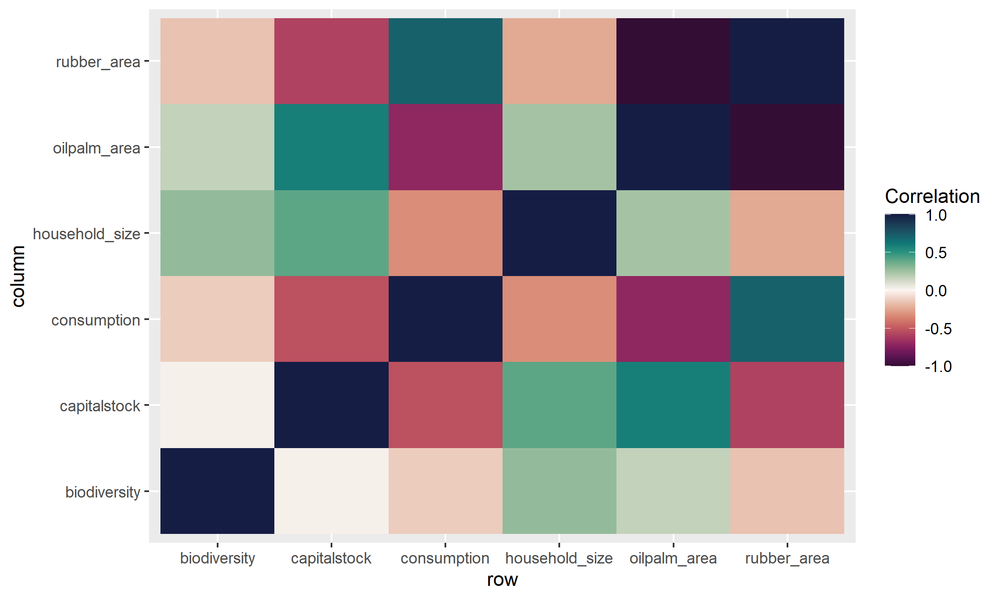

<!-- This is the format for text comments that will be ignored during renderings. Do not put R code in these comments because it will not be ignored. -->

```{r setup, echo = FALSE}
knitr::opts_chunk$set(
  collapse = TRUE,
  warning = FALSE,
  message = FALSE,
  echo = FALSE,
  comment = "#>",
  fig.path = "../../03_Analyses/",
  dpi = 300
)
```

# How prices drive landscapes

Main question: How do price differences drive certain aspects of the households in the landscape


```{r corplot, fig.align = 'center', out.width = "100%", fig.cap = "Correlations plot"}

```


```{r corplot, fig.align = 'center', out.width = "100%", fig.cap = "Correlations plot"}
knitr::include_graphics("../../03_Analyses/04_testing_Refforts/prices_ff_tradeoff.png")
```

Correlations are displayed in Figure \@ref(fig:corplot)

Here is a citation [@Marwick2017]

# Background

# Methods

# Results


# Discussion

# Conclusion

# Acknowledgements

<!-- The following line inserts a page break  -->
\newpage

# References 
<!-- The following line ensures the references appear here for the MS Word or HTML output files, rather than right at the end of the document (this will not work for PDF files):  -->
<div id="refs"></div>

\newpage

### Colophon

This report was generated on `r Sys.time()` using the following computational environment and dependencies: 

```{r colophon, cache = FALSE}
# which R packages and versions?
if ("devtools" %in% installed.packages()) devtools::session_info()
```

The current Git commit details are:

```{r}
# what commit is this file at? 
if ("git2r" %in% installed.packages() & git2r::in_repository(path = ".")) git2r::repository(here::here())  
```
