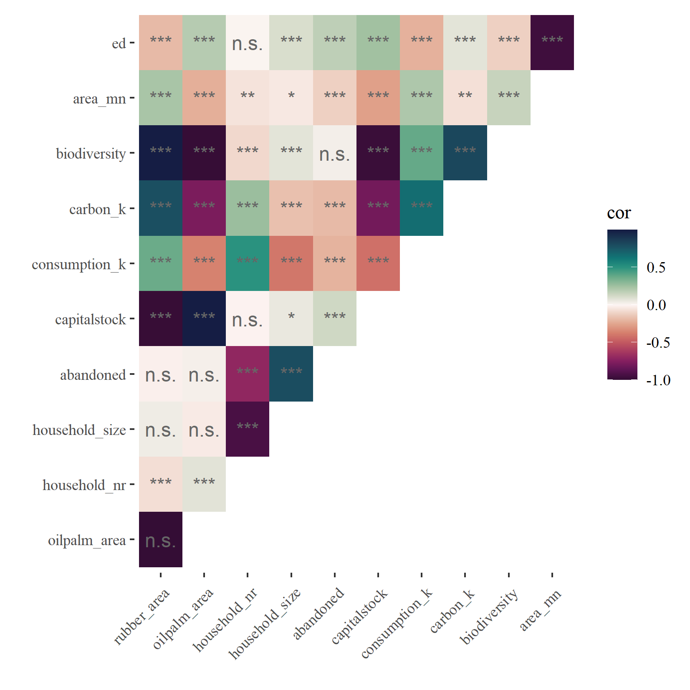
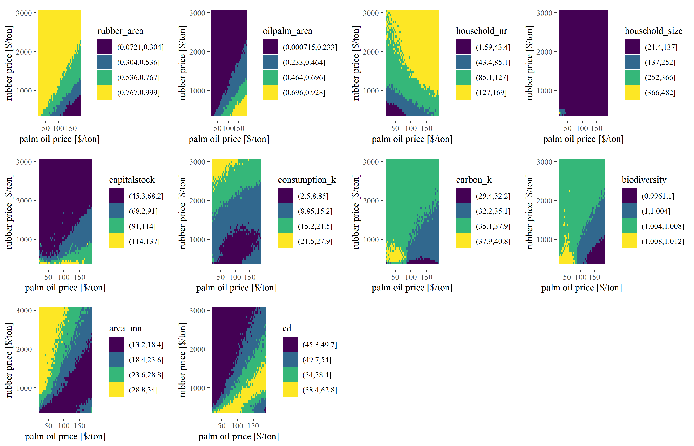
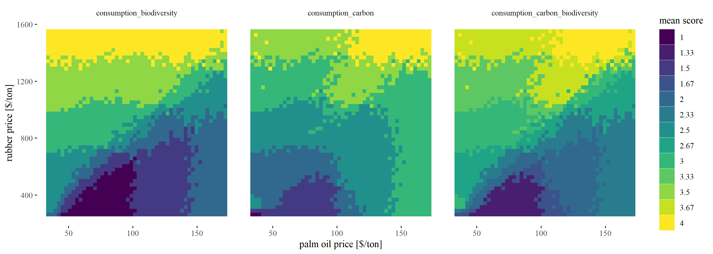

<!-- This is the format for text comments that will be ignored during renderings. Do not put R code in these comments because it will not be ignored. -->

```{r setup, echo = FALSE}
knitr::opts_chunk$set(
  collapse = TRUE,
  warning = FALSE,
  message = FALSE,
  echo = FALSE,
  comment = "#>",
  fig.path = "../../03_Analyses/",
  dpi = 300
)
```

## How prices drive landscapes

Main question: How do price differences drive certain aspects of the households in the landscape.

This analysis serves two purposes:

1. We want to check/benchmark the new landmarket module. In order to check that the landmarket module does what it is intended to do, we need to run the model under different parameterizations and check the outcome.
2. We want to learn more about our system. This analysis is inspired from the constant prices scenario of our first paper. In the paper we found a stable equlibirum with both, oilpalm and rubber, when heterogeneity is present. However, we did not look at different price levels back then. So now, I want to know what happens when we change the prices - at which points do landscapes switch to other patterns, etc.

In order to collect results, I ran a simple experiment:

I varied the prices for rubber and oilpalm in an full-factorial design. The minimum and maximum prices were derived from the historical price data. The landmarkets were set to active, and heterogeneity is present with learning activated. 

## Comments on first analysis

After running and analysing the first experiment, I noticed some strange things within the land distribution.
Land can still be abandoned even when the landmarket module is active. This problem arises, when no buyer in the potential buyer pool wants to buy the land, which can happen due to bad prices for both crops. Then, we still have the problem of abandoned land in the model.
Additionally, in the former landmarket module, land was offered once when any household went bankrupt or was selling land due to household age. Then, if no buyer was determined, land was just abandoned. 
I updated this routine in the new version: Now, landmarkets can persist over multiple ticks. Active landmarkets will be offered again in the next tick if no buyer was determined. That way, land may be bought once prices are better or households were able to collect some wealth for investment. Even with this version, abandoned land might still be present and we need to decide what to do with it in the future (see Outlook)!

## Results of full-factorial price experiment with current model version

I first extracted the 25 last years of each simulation and checked the correlation between different output measurements:

```{r corplot, fig.align = 'center', out.width = "100%", fig.cap = "Correlations"}

```

We can see quite heavy correlations among many different outputs (Fig. \@ref(fig:corplot)).
The spatial variables edge density (ed) and patch area (area_mn) are strongly correlated.
Biodiversity is correlated positively with rubber_area and carbon, but negatively correlated with oilpalm_area and capitalstock.
Household size is correlated with household number, indicating that our landmarket module seems to be working.

Now lets take a look at some output measurements. Again, I only took output from the last 25 years and classified each output into 8 classes for improved visualization (Fig. \@ref(fig:metrics)).

```{r metrics, fig.align = 'center', out.width = "100%", fig.cap = "Metrics"}

```

The first two panels (rubber area, oilpalm area) are quite clear: Rubber area is high when rubber prices are high. Oilpalm shows a reversed pattern. However, we can now see the price levels at which certain percentages are reached. We can also see that the area of crops scales linearly with prices. 

The next four panels (household_nr, immigrant_nr, household_size, abandoned) give us some information on the landmarket. We can see, that with high prices, we more or less stay at the initial number of households (192). When prices are lower, we have less households in the model, however we only see larger houshold size effects for very low prices. This seems to be a bit contradictory at first, but what happens is that for intermediate prices we lose small households only. Households with only one or two fields are more likely to leave the model, thus we see a decrease in household number, but no significant increas in household size. We can also see that the landmarket seems to be quite active for very low prices where we see strong decreases in household number and strong increases in immigrant number and household area. We can also see that the abandoned land seems to be a problem only when prices are very low.

The capitalstock panel shows high capitalstock for low prices? I need to investigate this further.

The consumption panel shows that consumption is high when at least one crop shows high prices. For carbon, we see very high levels for small prices, probably because households are not able to replant old plantations. The biodiversity is calculated with preliminary parameter values, so we need to take caution interpreting these values. But it seems that rubber-dominated farming is better for landscape-wise biodiversity.

Finally, the last two panels (area_mn, ed) show landscape metrics. Both are heavily correlated. Patch area is smallest and edge density highest, when we have a mixture of both crops. Patch area is increasing and edge density is decreasing for landscapes which are dominated by one crop.

Of course, we are again intrested at trade-offs between consumption, carbon and biodiversity. Here, it might be interesting to see if we find overlapping areas of maximum benefit. Or in other words: do we find areas in these tile plots, where all three metrics are in the highest class? In order to calculate these trade-offs, again I classified these three outputs. This time I used 4 classes (representing quartiles) to keep the score calculation more simple. I then calculated the mean class-value for each cell of our full-factorial design. Meaning, if a cell has the value 4, it was found in the maximum class for all considered outputs.

```{r tradeoff, fig.align = 'center', out.width = "100%", fig.cap = "Tradeoffs"}

```

And indeed, we find combinations with a value of 4 (Fig. \@ref(fig:tradeoff)), even for all three outputs (right panel). However, we only find this when prices are high for both crops.
What we can also see is that class values are higher when rubber prices are high and the landscape has a relatively higher rubber fraction. In sumamry, landscapes that are oil palm dominated show stronger trade-offs between the economic and ecological sphere than landscapes that are rubber dominated!
REMINDER: Biodiversity values are still based on rough estimates!


## Outlook

The most important thing is to improve the biodiversity model. Julia is working on this!
Besides that some questions need to be discussed:

* What do you think of the experimental design (full-factorial with constant prices)?
    * I find it very interesting and easy to understand - Is this interesting also for publication (I think yes)?
    * Do you have suggestions for improvements? (other/additional metrics)
    * Should we add even more complexity?
* How do we want to treat the abandoned land in the future?
* What is going wrong with the capitalstock?
* Why do we see the highest AND lowest carbon class for low prices?


<!-- The following line inserts a page break  -->
\newpage

# References 
<!-- The following line ensures the references appear here for the MS Word or HTML output files, rather than right at the end of the document (this will not work for PDF files):  -->
<div id="refs"></div>

\newpage

### Colophon

This report was generated on `r Sys.time()` using the following computational environment and dependencies: 

```{r colophon, cache = FALSE}
# which R packages and versions?
if ("devtools" %in% installed.packages()) devtools::session_info()
```

The current Git commit details are:

```{r}
# what commit is this file at? 
if ("git2r" %in% installed.packages() & git2r::in_repository(path = ".")) git2r::repository(here::here())  
```
