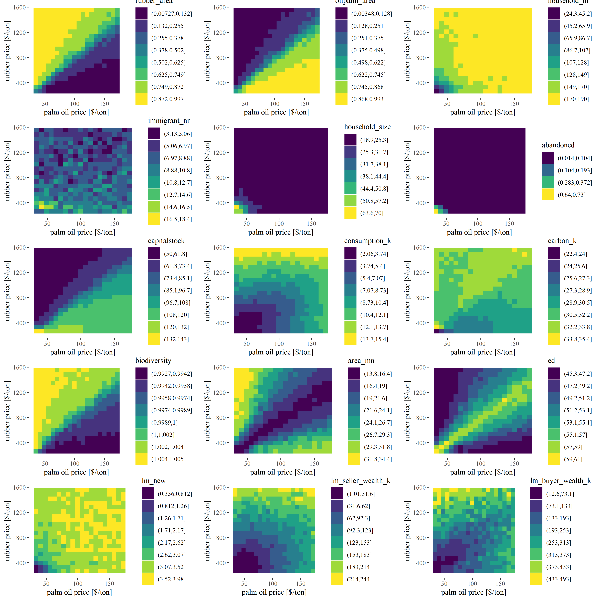
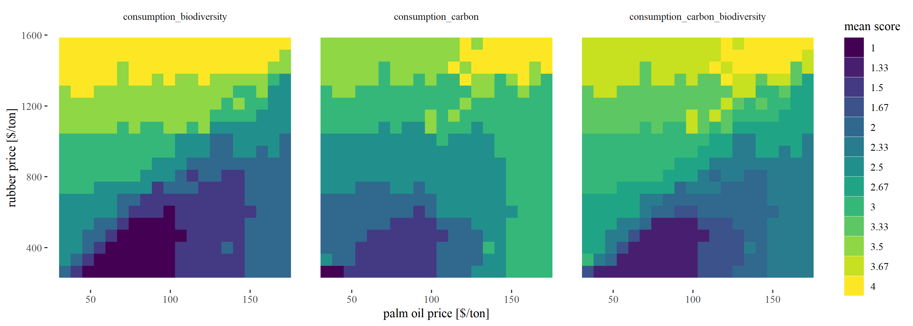
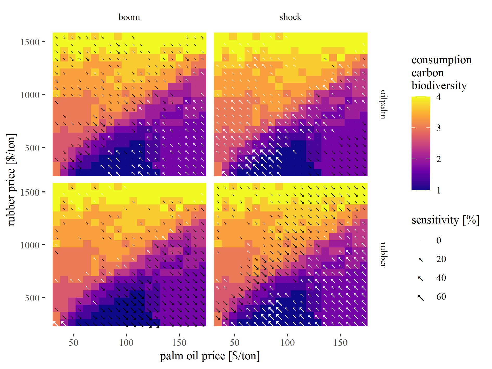
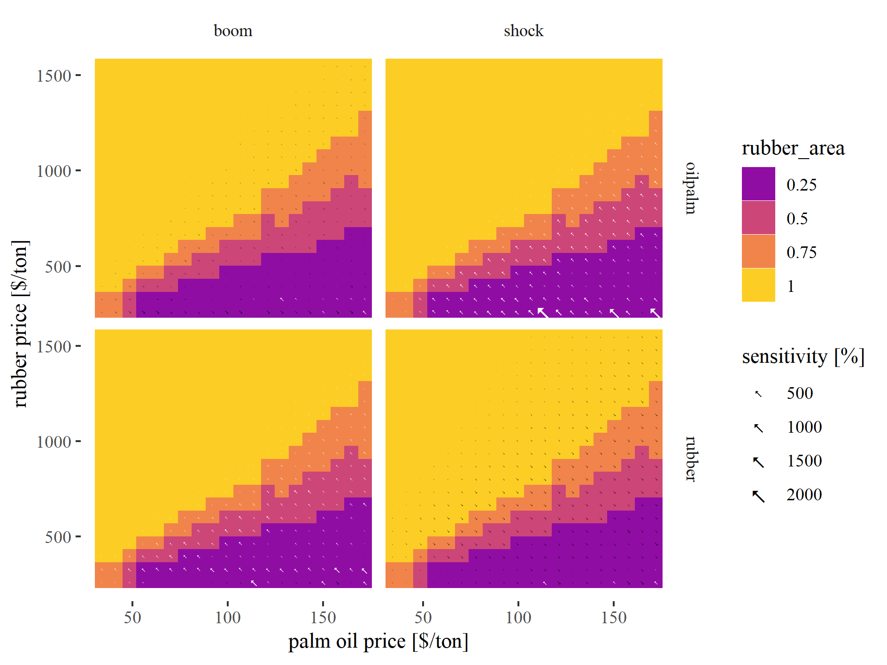
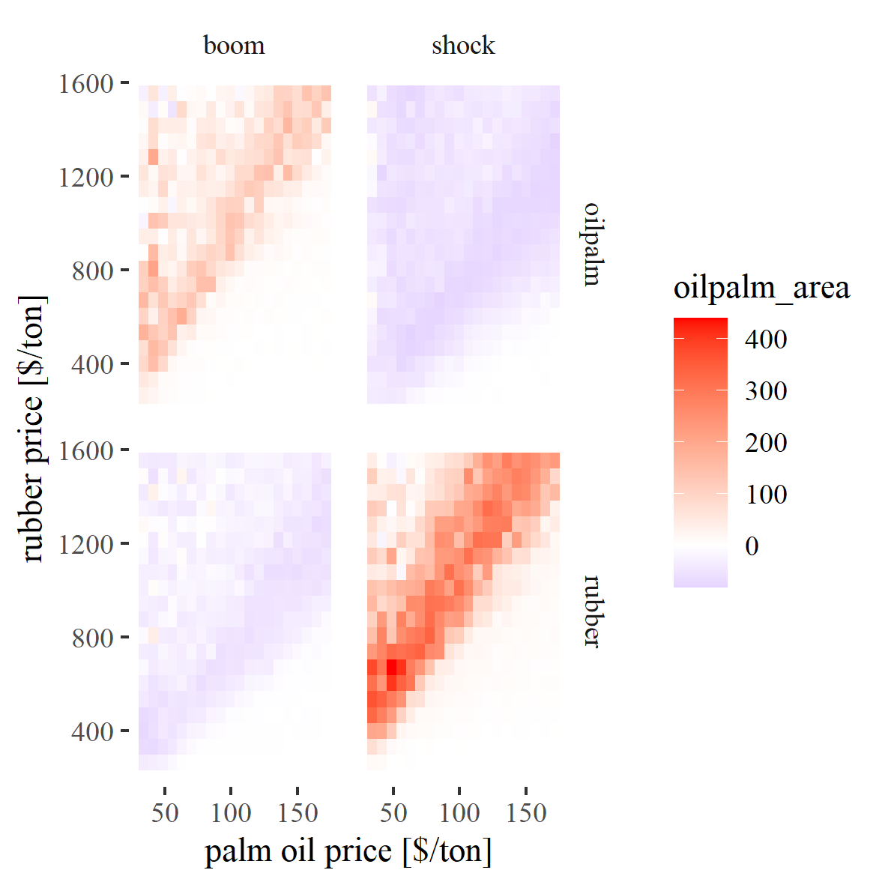
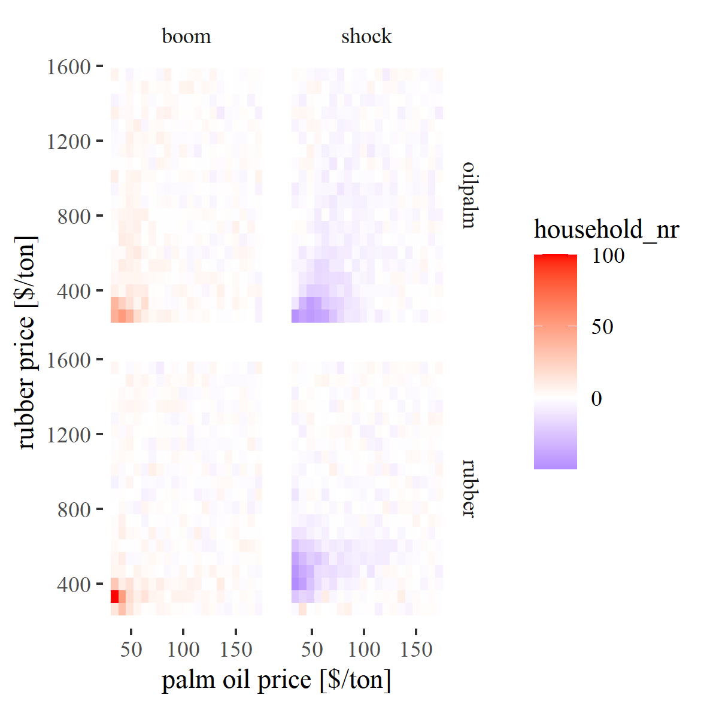
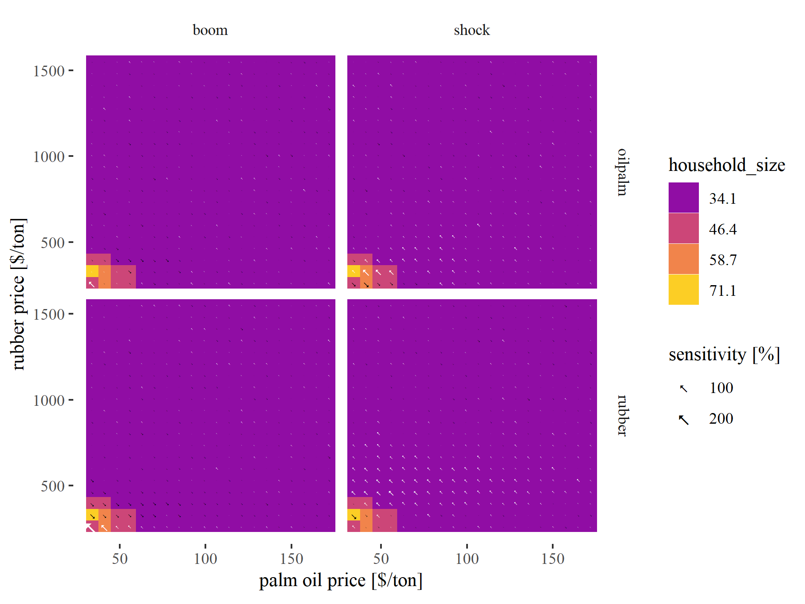
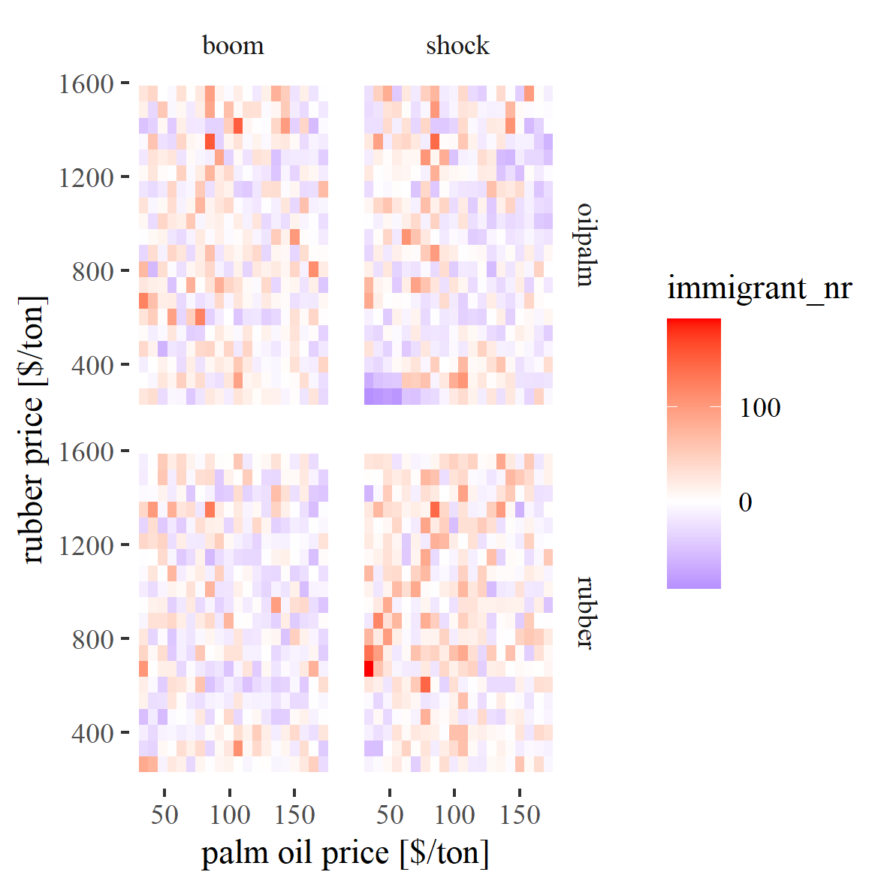

<!-- This is the format for text comments that will be ignored during renderings. Do not put R code in these comments because it will not be ignored. -->

```{r setup, echo = FALSE}
knitr::opts_chunk$set(
  collapse = TRUE,
  warning = FALSE,
  message = FALSE,
  echo = FALSE,
  comment = "#>",
  fig.path = "../../03_Analyses/",
  dpi = 300
)
```

## Introduction

Land-use changes have dramatically altered tropical landscapes in past decades [@Powell2015]. bla bla bla.

Economic models are great learning tools to understand the underlying dynamics and processes [cite]. Recently, economic models are coupled to ecological models in order to gain insights into trade-offs and synergies between the ecological and socio-economic sphere [@Schulze2017; @An2012]. EFForTS-ABM is such a coupled socio-economic ecological simulation model, focusing on smallholder agriculture in Jambi province, Indonesia [@Dislich2018]. The model simulates rational economic decision-making of smallholder farmers and calculates consequences on the ecological sphere. In earlier publications and detailed sensitivity analyses we found that output crop prices are major drivers of economic and ecological patterns at multiple spatial and temporal scales [@Dislich2018]. For example, low prices led to a high amount of bankrupcy of smallholders, expecially when heterogenous farming efficiency was included [@Dislich2018]. This led to high amounts of abandoned land. In reality however, land is mostly offered on the land market when smallholders drop out of business. Thus, we implemented a new model version that features a landmarket module which allows the transfer of land between households. Here we present a detailed analysis of the new version of EFForTS-ABM including a detailed analyses of the new landmarket activities.

Because prices were the main driver for smallholder bankrupcy [@Dislich2018] we assume that prices are also the main driver of landmarket activities within our simulations. In order to gain a detailed understanding of model interactions, we need to conduct and analyze price scenarios. In the real world, crop output prices depend on global markets and are very dynamic and nearly unpredictable [cite]. In general, we see two approaches on tackling this issue: (i) If the goal is to run model simulations that are close to reality, one could use historical output price data (as we did before, see xy [cite]) or simulated price data. (ii) If the goal is however to learn about the model processes and interactions, dynamic output prices create a lot of noise which hinders accurate interpretations of underlying mechanisms. In such cases, it is essential to investigate simple price scenarios, such as constant prices including price shock events at one point in time.

In this paper, we want to investigate our simulation model EFForTS-ABM, using the second kind of approach. Here, we are interested how different facets of spatial and non-spatial output react to changes in the output crop prices. The main question is therefore, "How do prices affect household properties, landscape properties, and overall economic and ecological indicators in EFForTS-ABM?".

## Methods

Our analysis was conducted with EFForTS-ABM version xy [cite]. Simulations were executed on the GWDG-HPC of the university of Göttingen, through the R package nlrx [@Salecker2019a]. The initial landscape was created through our landscape generator EFForTS-LGraf [@Salecker2019]. A detailed description of the EFForTS-ABM model was published in [@Dislich2018].

#### Short description of EFForTS-ABM

- Jan

#### Description of the new landmarket module

- Sebastian Renner

#### Description of the biodiversity module

- Julia Henzler

#### Scenarios

Smallholders in our model landscapes were allowed to choose between two different crop types: oil palm and rubber monoculture. Simulations are performed over 50 simulation years. In our simulation experiment, we varied the output prices of these two crops in a full-factorial simulation design. The minimum and maximum price levels for both crops were derived from historical price data [cite]. We varied both prices between minimum and maximum by adding 18 intermediate steps with equal intervals, resulting in a matrix of 20 x 20 simulations. As additional scenarios, we were interested how certain price events affect measured outputs. We ran 4 such events that were triggered after 20 years of simulation under the default parameterization. The events were a price reduction of -50% for rubber or palm oil and a price boom of +50% for rubber or palm oil. Thus, the 20 x 20 parameter matrix was executed 5 times in total (default, shock rubber, shock oilpalm, boom rubber, boom oilpalm) with 3 replicates, resulting in 6000 simulations.

Several spatial and non-spatial outputs were collected during and after simulations (see Table xy).
Output measurements can be classified by scale (household, villages, cell, patch, landscape) and by category (economic, ecological). 

*Further parameterisation: The landmarkets were set to active, and heterogeneity is present with learning activated.*


## Results and discussion

#### Part I: 

We ran the full-factorial simulation design and exported output from the last 25 years. Afterwards, each output was classified into 8 distinct classes, representing equal intervals of values.

```{r rawvar, out.width = "100%", fig.cap = "Variation of output under different output prices. Each output was classified into 8 distinct classes representing equal intervals where bright colors indicate classes with the highest values and dark colors represent classes with the lowest values. Consumption, carbon and wealth values were divided by 1000."}

```

We observed a larger area of rubber agriculture with high rubber output prices and a larger area of oilpalm agriculture with high palm oil prices (see panel a,b in Fig. \@ref(fig:rawvar)). The area of crops scales mostly linear with the respective output prices and indicates that our rationale economic decision-making algorithm works as expected. When prices are high smallholder agents automatically shift to the more profitable crop. However, due to the crop-specific inefficiencies, profitability is not euqally distributed among agents, which leads to the observed variability of crop choices for intermediate prices.

The next seven panels (see panel c-i in Fig. \@ref(fig:rawvar)) give us detailed information on the new landmarket submodel. 
The number of households, number of immigrants and average household size allow us to observe consolidation effects within the model. When prices for both crops are low, we observe fewer households with larger household area, meaning that only the most efficient households are able to stay in business and buy land from other smallholders (see panel c,e in Fig. \@ref(fig:rawvar)). For intermediate prices we observe a decline in household number of no strong decrease of household size. Here, inefficient households with only one or two fields are more likely to leave the model, thus we see a decrease in household number, but no significant increase in household size. For very low prices we observe a peak in the number of immigrant households, which indicates that here even the remaining initial households in the model are not able to utilize landmarket investments efficiently (see panel d in Fig. \@ref(fig:rawvar)). In such cases we could also observe some abandoned land of up to 73% when both crop prices were at their minimum (see panel f in Fig. \@ref(fig:rawvar)). That means that neither initial, nor immigrant households were able to sufficiently manage the land.

As expected, smallholder households offering land on the landmarket had relatively low wealth when compared to the average buyers wealth (see panel g,h,i in Fig. \@ref(fig:rawvar))). For low prices, sellers had only up to ~18% of the wealth of the final buyer of the offered land. The ratio between sellers and buyers wealth increased up to 83%, when both crops had intermediate to high output prices. Here, bankrupcy was not the main cause for landmarket transactions but insteaded, most landmarket offers were household-age related.


The capitalstock pattern is strange (see panel j in Fig. \@ref(fig:rawvar))!!!!! Jan: Talk to Jann

The average consumption of smallholders is high when at least one crop has intermediate to high prices (see panel k in Fig. \@ref(fig:rawvar)). We observe two extremes of carbon accumulation for very low prices and high prices (see panel l in Fig. \@ref(fig:rawvar)). These patterns are clearly related to the decision-making of the households. For low prices, land-use change is not worth the investment costs, thus carbon is continously accumulated due to less land-use change decisions. For very high prices, returns from land are stable and sufficient, thus life cycles of plantations are extended which also leads to higher carbon accumulation. Overall, we observe slightly higher carbon accumulation for high rubber prices, than for high palm oil prices. The biodiversity shows a very clear pattern with improved biodiversity for high rubber prices (see panel m in Fig. \@ref(fig:rawvar)). However, the biodiversity is calculated with preliminary parameter values, so we need to take caution interpreting these values. But it seems that rubber-dominated farming is better for landscape-wise biodiversity.

We were also intersted in spatial effects on landscape-scale. The mean patch area within the landscape was highest when only one of the two crops had higher prices (see panel n in Fig. \@ref(fig:rawvar)). The edge density showed a reverse pattern with highest heterogeneity for intermediate scenarios were both crops were equally present in the landscape (see panel o in Fig. \@ref(fig:rawvar)). Thus, patch area is increasing and edge density is decreasing for landscapes which are dominated by one crop.

#### Part II: Trade-offs and synergies

In the first part of our analysis, we could show that consumption (which relates to economic welfare within our virtual smallholder community), carbon accumulation and biodiversity follow quite different trajectories when output prices of crops change. Heterogeneous responses between different output variables automatically lead to trade-off and synergy cases when comparing these variables. All three variables relate to ecosystem functioning and services and are of utmost importance when it comes to policy design and conservation approaches towards fulfilling sustainable development goals in the future [cite]. Thus, we were highly intersted if there are certain price patterns that could lead to high synergies across the three outputs.

In order to calculate synergies, we classified each output into four value classes (representing quartiles). Then we calculated the mean class value of several outputs for each output price. Thus, a score of four indicates maximum synergy (both outputs were in the highest quartile).

```{r tradeoff, out.width = "100%", fig.cap = "Synergy score of three policy relevant outputs of EFForTS-ABM. Scores represent mean quartile across several outputs."}

```

Indeed, we observed cases were multiple outputs were located in the highest value class (see Fig. \@ref(fig:tradeoff)).
We could observe a large overlap of high consumption and biodiversity for high rubber prices. Even, when palm oil prices where comparably high, this synergy persisted. For consumption and carbon we observed a similar trend but synergy was best when prices for both crops were at their maximum. Finally, we found scenarios that lead to maximum class scores for all three outputs. Such price settings represent best case scenarios within our model landscapes. Such scenarios could be reached with very high rubber prices or intermediate prices for both crops. While a complete dominance of rubber could potentially lead to high synergy of economic and ecological outputs, this is not the case for oil palm. Here a complete dominance leads to stronger trade-offs among our measured outputs.  In sumamry, landscapes that are oil palm dominated show stronger trade-offs between the economic and ecological sphere than landscapes that are rubber dominated!


#### Part III: Sensitivity towards price changes

When we took price shock and price boom events into account heterogeneous patterns emerged.
For agricultural area (rubber and oilpalm) we observed expected patterns. If prices boomed for one specific crop, the area of that crop increased and vice versa (see Fig. \@ref(fig:sensrmarea) and \@ref(fig:sensoparea) in Appendix I).

The number of households in the model and the mean household size were only significantly affected at very low price settings (see Fig. \@ref(fig:senshhn) and \@ref(fig:senshhsize) in Appendix I). The sensitivity of the number of immigrant households towards price events showed a radnom pattern and no direct relation to the initial price settings (see Fig. \@ref(fig:sensimmin) in Appendix I).

...
...


We also investigated the sensitivity of our synergy scores that explicitly incorporate the economic and ecological sphere.
A boom in palm oil prices led to an improvement of synergies only for scenarios where the landscape was already dominated by oil palm (see Fig. \@ref(fig:sensitivity)). When oil palm prices dropped drastically, we see an improvement for most initial price settings, except cases where rubber prices where very low and oil palm prices where high. These are again, landscapes that are completely dominated by oil palm agriculture. A drastic prices drop thus heavily reduces consumption values in the landscape as households are not able to compensate lower palm oil prices with rubber agriculture.

A boom in rubber prices led to decreasing synergy scores for all landscapes that were oilpalm dominated. Only landscapes that had an equal share of rubber and oilpalm or landscapes completely rubber dominated could profit from the price boom. The rubber price shock heavily decreased the synergy score of many rubber dominated landscapes. However, it also increased the synergy score of all landscapes that were previously oilpalm dominated.

```{r sensitivity, out.width = "100%", fig.cap = "Sensitivity of trade-off scores towards price events under different initial price settings. Arrows indicate sensitivity direction and strength (line thickness). White dots indicate no change."}

```


## Outlook

The most important thing is to improve the biodiversity model. Julia is working on this!
Besides that some questions need to be discussed:

* What do you think of the experimental design (full-factorial with constant prices)?
    * I find it very interesting and easy to understand - Is this interesting also for publication (I think yes)?
    * Do you have suggestions for improvements? (other/additional metrics)
    * Should we add even more complexity?
* How do we want to treat the abandoned land in the future?
* What is going wrong with the capitalstock?
* Why do we see the highest AND lowest carbon class for low prices?


<!-- The following line inserts a page break  -->
\newpage

# References 
<!-- The following line ensures the references appear here for the MS Word or HTML output files, rather than right at the end of the document (this will not work for PDF files):  -->
<div id="refs"></div>


\newpage

### Appendix

#### Appendix I: Additional price event sensitivity plots

```{r sensrmarea, out.width = "100%", fig.cap = "Sensitivity [%] of mean rubber area towards price events under different initial price settings."}

```

```{r sensoparea, out.width = "100%", fig.cap = "Sensitivity [%] of mean oilpalm area towards price events under different initial price settings."}

```

```{r senshhn, out.width = "100%", fig.cap = "Sensitivity [%] of household number towards price events under different initial price settings."}

```

```{r senshhsize, out.width = "100%", fig.cap = "Sensitivity [%] of household size towards price events under different initial price settings."}

```

```{r sensimmin, out.width = "100%", fig.cap = "Sensitivity [%] of immigrant number towards price events under different initial price settings."}

```

\newpage

### Colophon

This report was generated on `r Sys.time()` using the following computational environment and dependencies: 

```{r colophon, cache = FALSE}
# which R packages and versions?
if ("devtools" %in% installed.packages()) devtools::session_info()
```

The current Git commit details are:

```{r}
# what commit is this file at? 
if ("git2r" %in% installed.packages() & git2r::in_repository(path = ".")) git2r::repository(here::here())  
```
