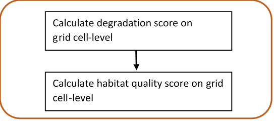
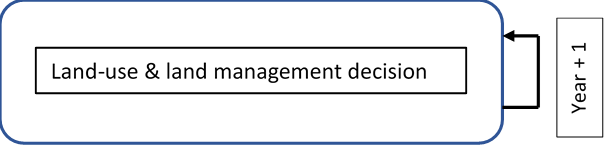
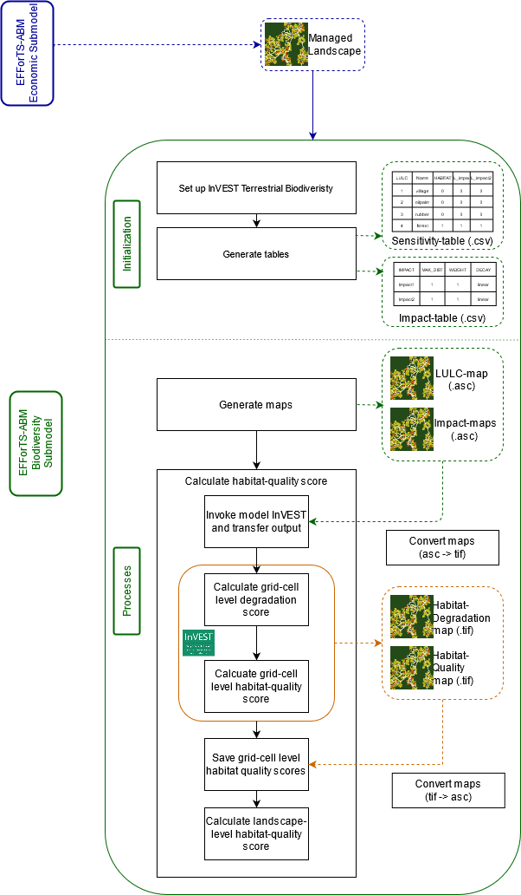

^1^ Ecosystem Modeling, Faculty of Forest Sciences and Forest Ecology University of Goettingen, Goettingen, Germany, ^2^ Craig: please fill in, ^3^ Jan: please fill in

*Julia.henzler@uni-goettingen.de

**Target Journals:**Methods in Ecology and Evolution, PLOS Computational Biology, Ecological Modeling


**Keywords:**ecological functions, biodiversity, socio-economic functions, EFForTS-ABM, InVEST, trade-offs, software connection 


**Key message:** Demonstration of the integration of the static terrestrial biodiversity model InVEST with the dynamic land-use change model EFForTS-ABM. As a result, synergies and trade-offs between biodiversity and socio-economic functions can be assessed simultaneously and dynamically at multiple temporal and spatial scales.


# 1. Introduction
*	Relationship between ecological and socio-economic functions for conservation issues
    +	Ecological and socio-economic sphere (biodiversity as key index)
    +	Trade-offs and Synergies and possible problems when unbalanced
    +	Open question: Unclear relationship over time and space and the consequence for conservation

*Rethink the audience and address first paragraph of introduction accordingly.*

*	Representation of both models separately and their issues 
    + Models are capable of examining relationships over multiple temporal and spatial scales....
    + InVEST was developed for changes of ecosystems at different spatial and temporal scales but is a static model (as only 3 different landscapes can be used as input for simulation). Rapid assessment of biodiversity patterns and status : ecological functions + biodiversity via ecological production functions, static model, proven model: examples of applications 
    +	EFForTS-ABM is a land-use change model where landscape is managed: socio-economic function, dynamic model

*	Benefits of connection of EFForTS-ABM and InVEST:
    +	EFForTS-ABM can be used as dynamic input for InVEST
    +	EFForTS-ABM fits requirements to generate input for InVEST 
    +	Output of InVEST can be processed dynamically within EFForTS-ABM

*	Aim and Hypotheses
    +	Aim: Tool for simultaneously model socio-economic functions and biodiversity over time and space
    +	Connection is possible through narrow integrationlayer it can be easily implemented, maintained and comprehended (maybe to Abstract).	


# Methods

**Integration of InVEST with EFForTS-ABM** 

For the simultaneous simulation of biodiversity and socio-economic functions we integrated two already existing models. EFForTS-ABM and InVEST were used complementary. EFForTS-ABM generated the land-use and land-cover maps (LULC-maps) and the parameter setting for the integration into InVEST. Whereas InVEST reintegrated the calculated biodiversity for further processing within EFForTS-ABM. We developed functional and non-functional requirements for correct implementation. 
*Mention at first in intro or at first in methods?*

The static production function model InVEST-Terrestrial Biodiversity (Version 3.9, Tier 1) was used to simulate biodiversity [@kareiva_natural_2012]. The function is spatially-explicit and calculates a grid cell-level degradation score for every grid cell which was assigned a habitat value. The calculation is based on a user-defined LULC-map, on user-defined impacts to biodiversity and on location and distance of grid cells to impacts (for a full description of the calculation read @sharp_r_invest_nodate). This degradation score is then standardized to a grid cell-level habitat quality score (Figure 1) via a half-saturation function. The habitat quality score is a proxy for biodiversity based on a simple habitat-analysis, enabling rapid assessment of biodiversity patterns. InVEST is a scientifically grounded tool and is verified as a widely applied software tool for simulation of biodiversity and ecological functions based on spatially-explicit maps. A detailed user guide was published in @sharp_r_invest_nodate.

<br>



<br>

To simulate the socio-economic compoenent of the analysis, the dynamic land-use change model EFForTS-ABM (version xyz) was used. The initial landscapes for EFForTS-ABM are generated with the landscape generator EFForTS-LGraf. Landscapes are comprised of regular grid cells of 100 x 100 cells with a dimension of 50 m x 50 m, summing up a total landscape dimension of 25km^2^. They represent a forested landscape in Sumatra (Indonesia) with roads and villages of smallholder farming household agents and agricultural fields (oilpalm and rubber) owned and farmed by individual households. Every year households make rational land-use decisions with the aim to maximize their economic benefit (Figure 2). Detailed descriptions of EFForTS-LGraf and EFForTS-ABM were published in @salecker_efforts-lgraf_2019 and @dislich_land-use_2018, respectively. EFForTS-ABM is able to investigate how decisions of smallholders affect economic functions (e.g. household consumption) and landscape structure from a local to a landscape scale and vice versa at various points in time. The ABM comprises a spatially-explicit landscape with assignment of land use (management) and land cover (oilpalm, rubber, forest, village) to each grid cell. The impacts to biodiversity (from either land use or land cover) can easily be derived from EFForTS-ABM. The ABM is also suitable to integrate the generated habitat quality maps from InVEST. Therefore, EFForTS-ABM fits requirements for dynamically generate the input for InVEST and dynamically process the output of InVEST.



<br>

The implementation of both models was achieved by an Input-Output-Transfer. We mapped the outputs from EFForTS-ABM as the inputs to InVEST and mapped the outputs from InVEST as the inputs EFForTS-ABM. First, EFForTS-ABM generates the inputs - the LULC-map and one impact-map for each defined impact in Tag Image File format (tif-format) and a corresponding sensitivity-table and impact-table in csv-format. Second, InVEST integrates the generated inputs of EFForTS-ABM and calculates the habitat-degradation-map and habitat-quality-map in tif-format for further processing in EFForTS-ABM (Figure 3). To facilitate the transferring of maps, we included a converter, as EFForTS-ABM is only able to process Action Script Communication format (asc-format) and InVEST is only able to process tif-format.


<br>

**Evaluation of integration of InVEST with EFForTS-ABM**

To evaluate the integration between the static production function model InVEST and the dynamic land-use change model EFForTS-ABM, we adopted a widely applied software testing system as our requirement plan [@bashar_requirements_2000]. This plan was divided into functional and non-functional requirements.

The functional requirements included a testing scheme beginning from unit-tests to integration-tests and ending with an acceptance-test [@a_contan_test_2018]. Unit-tests were applied to verify the correct implementation of functions. This was realized by an isolated unit-testing module within EFForTS-ABM. This module comprised each particular function implemented via the connection of EfforTS-ABM and InVEST. We compared the simulated output of each particular function to its expected output. Integration-tests were applied to verify the correct integration between InVEST and EFForTS-ABM. This could be proven by correct Input-Output-Processing. It was realized by an isolated integration-testing module within EFForTS-ABM. For more convenient comparison of results, we chose a simplified parameter setting (see table 1 and table 2) - with a binary approach for both habitat-assignment and for the sensitivity of LULC-types to impacts - and two simplified landscapes - forest-landscape and single-field-landscape. First, to verify the correct calculation of habitat-quality scores, the simulated grid cell-level habitat quality scores for the forest-landscape were compared to the expected output. Second, the simulated grid cell-level habitat-quality scores for the one-field-landscape were compared to the expected output to verify the correct reduction of habitat quality scores by the defined impacts.

<br>

```{r sensitivty table,echo=FALSE}
#Create dataframe from txt file
sensitivity <- read.table("Tables/sensitivitytable_integrationtest.txt", header = TRUE)
sens <- data.frame(sensitivity)

#Create table
knitr::kable(sens, caption = 'Table 1: **Sensitivity table.** Classification (LULC) and names (NAMES) of LULC-types and their correspoding habitat assignment (HABITAT) and sensitivities to defined impacts (L_oilpalm, L-rubber). ')
```

<br>

```{r impact table,echo=FALSE}
#Create dataframe from txt file
impact <- read.table("Tables/impacttable_integrationtest.txt", header = TRUE)
imp <- data.frame(impact)

#Create table
knitr::kable(imp, caption = 'Table 2: **Impact table.** Maximal distance of each impact over space (MAX_DIST in 50 m), its corresponding impact weighting (WEIGHT) and how impacts decay over space (DECAY). ')
```

<br>

The acceptance-test was applied to verify the dynamic simulation of socio-economic functions and biodiversity simultaneously. This test represents a constant price scenario without learning and without any landmarket. The landscape is parameterized with data from a lowland rainforest transformation system in Sumatra, Indonesia. Parameter setting for InVEST is shown in tables 1 and 2. Parameter setting for EFForTS-ABM is shown in table 3. The household consumption of all households was analyzed as one representative for socio-economic-functions. The landscape-level habitat quality score, which is a aggregation of all grid cell-level habitat quality scores, was analyzed as the representative for biodiversity. Each test was executed with the R package nlrx (version xyz)[@salecker_nlrx_2019].

<br>

```{r Parameter setting EFForTS-ABM, echo=FALSE}
#Create dataframe
para_efforts <- data.frame(Parameters = c("Prices", "Learning", "Inefficiency", "which-map", "land-use-change-decision", "initial-wealth-distribution", "landmarket", "biodiv_plants", "biodiv_plants_objective"),
                 Value = c("constant prices", "no learning", "no inefficiency", "five-farmers2", "only-one-field-per-year", "constant", "no landmarket", "invest_pyhton", "general")
                 )

#Create table
knitr::kable(para_efforts, caption = 'Table 3: **Parameter setting for EFForTS-ABM** (Maybe move to Supplementary Materials. ')
```

The non-functional requirements include the reproducibility of the integrated EFForTS-ABM-InVEST software tool. Simulations can be executed on a linux-server or on a high-performance-cluster with a uniform software management, a shared batch management environment, cross-system monitoring and accounting, and cross-system file systems. The simulations were submitted to the high-performance-cluster by the R package clustermq (version xyz, @schubert_clustermq_2019). For the execution of the simulations on a server, we designed a repository [<https://github.com/nilsbeyer/rstudio-docker>]. It includes setup instructions and a dockerfile with the correct version of InVEST and its required dependencies along with an R-Studio-Server for execution of simulations. *Also describe in detail the setup etc, which is listed in repository?* For the execution of the simulations on a high-performance-cluster, we designed a singularity container, which duplicates the dockerfile into a singularityfile on the cluster. *Here, we have to wait for further progress. Actually, there is no function within cluster_mq to run a singularity container on the hpc. We opened an issue and wait for response. If there is no convenient way to run singularity on hpc, we have to work with an manual installation of InVEST on the cluster.*


# 3. Results
*	Integrated Models:


 
*	Implementation of biodiversity submodel as connection point and realization of Input-Output-Transfer: 
    +	set-up-invest, write-tables, write-maps, convert-maps, run-invest, convert-habitat-quality-to-asc, save-habitat-quality-to-patch, aggregate-habitat-quality 
*	Functional requirements: results from test pyramid
*	Non-functional requirements: dockerfile and singularity-container	

# 4. Discussion
*	Possible points to discuss
    +	Benefit of connection instead of usage separately (dynamic simulations, feedback between economic functions and biodiversity,….)
    +	Reference to Acceptance Test
    + Comparison of ABM and InVEST with table (classification of models) and point to important difference
*	Conclusions
    +	Easy implementation, easy adjusting to different models
    +	New tool for assessing socio-economic functions simultaneously with ecological functions and biodiversity over time and space 
	  + flexible:extend to Tier 2 with incooperation of species-specific data
	  
# 5. Acknowledgements
Funded by the Deutsche Forschungsgemeinschaft (DFG, German Research Foundation) – project number 192626868 – SFB 990 in the framework of the collaborative German-Indonesian research project CRC 990. Thank reviewers.	

# 6. Supplementary material
*	Include more detailed Software-Architecture with every in- and output of both models (especially for economic submodel of EFForTS-ABM)


# Open questions:
* Include ODD-protocol for models? I would say no, because the focus is not on the models itself, but more on the connection, its realisation and the benefit.

# References:


